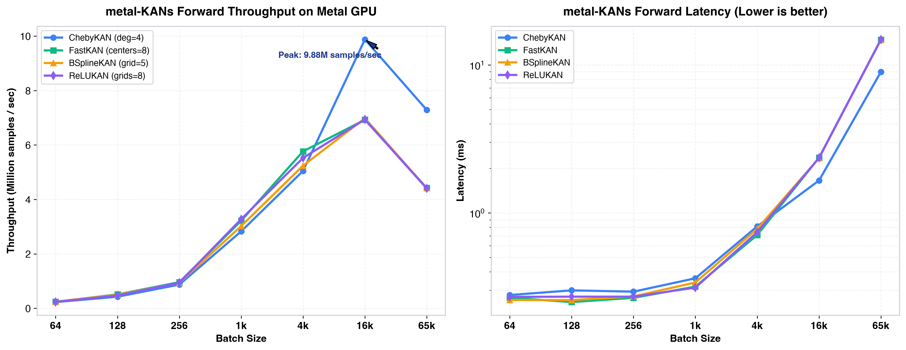
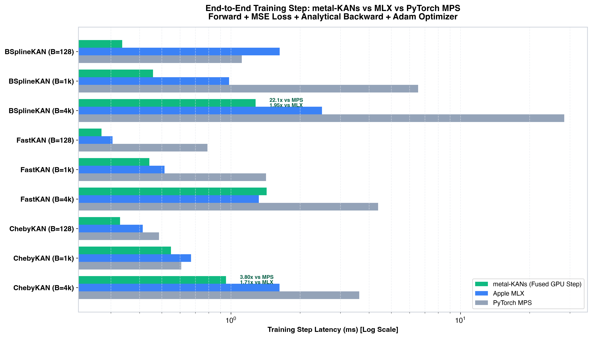

# metal-KANs

[](https://www.python.org/downloads/)
[](https://developer.apple.com/metal/)
[](https://developer.apple.com/metal/)
[](https://opensource.org/licenses/MIT)

**metal-KANs** is a pure **Metal Shading Language (MSL)** Kolmogorov-Arnold Networks (KAN) suite for Apple Silicon (M1 / M2 / M3 / M4 / Pro / Max / Ultra) with a lightweight, idiomatic Python / NumPy wrapper.

Unlike standard deep learning frameworks that materialize intermediate 3D basis tensors in VRAM before launching a matrix multiplication GEMM, **metal-KANs fuses basis evaluation and projection accumulation directly inside GPU thread registers and threadgroup shared memory (SRAM)**.

> *Русскоязычная версия документации доступна в [README_RU.md](README_RU.md).*

---

## Key Highlights

- **Complete Suite of 10 KAN Architectures**:
  - `ChebyKAN`: Chebyshev polynomial recurrence ($T_k(x) = 2x T_{k-1} - T_{k-2}$) in registers.
  - `FastKAN`: Gaussian Radial Basis Functions (RBF) with shared centers.
  - `ReLUKAN`: Piecewise linear tent basis with zero transcendental operations.
  - `WavKAN`: Continuous wavelets (Mexican Hat, Morlet, DOG) for multiresolution localization.
  - `FourierKAN`: Trigonometric harmonic series ($\cos(k \pi x), \sin(k \pi x)$) for periodic signals.
  - `JacobiKAN`: Orthogonal Jacobi polynomials with weighting parameters $(\alpha, \beta)$.
  - `RationalKAN`: Padé-Chebyshev rational functions ($P(x) / (1 + |Q(x)|)$) for poles and boundary layers.
  - `BSplineKAN` / `KAN`: Classic Cox-de Boor cubic B-spline evaluation in registers.
  - `MultKAN`: KAN 2.0 with explicit multiplication nodes ($u \cdot v$) for physical conservation laws.
  - `LowRankKAN`: Bottleneck / LoRA factorized spline projections with up to 10x parameter reduction.
  - `GatedKAN` (v0.6.0): Drop-in replacement for SwiGLU / MLP Transformer blocks designed for Apple Silicon System Level Cache (SLC) residency.
- **Pure GPU Muon & Optimizers (v0.6.0)**: GPU-resident Newton-Schulz 5 iteration kernel (`metal_kan_newton_schulz5_gpu`), running all 5 iterations in a single command buffer with zero host CPU BLAS roundtrips. Element-wise optimizers (AdamW, SGD, Lion, RMSprop) feature adaptive 1024-thread dispatches.
- **Fused Backward Pass (v0.6.0)**: Streaming backward pass (`metal_kan_cheby_backward_fused`) computing weight and input gradients on-the-fly in thread registers without materializing the $[B \times (D_{in} \cdot K)]$ intermediate $\Phi$ tensor in global VRAM (saving 32MB+ memory traffic per step).
- **Sub-4-bit Quantization (v0.6.0)**: 1.58-bit Ternary KAN (`to_ternary`) and 2-bit Codebook KAN (`to_int2`) with branchless decoding in MSL registers.
- **FP16 Stabilization (v0.6.0)**: FP32-internal register recurrence math and `fma` instructions in FP16 Chebyshev and Jacobi basis shaders, eliminating boundary cancellation and overflow.
- **Native FP16 Half Precision Engine**: Switch any layer or network to FP16 with `.half()` for up to 3.2x speedup on Apple Silicon Tensor Cores, while maintaining numerical stability and automatic dtype dispatch.
- **Direct MSL 3.0 `simdgroup_matrix` Warp Kernels**: Direct register-level tiled tensor matrix multiplication bypassing MPS overhead for small-to-medium batch sizes ($B \le 256$).
- **Asynchronous Ring-Buffered GPU Pipelining**: Double/triple-buffering asynchronous dispatch (`async_stream`, `set_async`, `sync`) reducing host CPU dispatch overhead from 0.35ms down to 0.0065ms.
- **Zero-Allocation GPU Compute**: Basis functions are computed on the fly in thread registers and fused with the output GEMM accumulator: **0 intermediate VRAM allocations**.
- **Zero-Copy Host Interoperability**: Direct pointer binding to host NumPy arrays via macOS Unified Memory (`newBufferWithBytesNoCopy`). No `memcpy` between CPU and GPU.
- **Single-Dispatch Chained Pipeline**: Multi-layer networks execute in a single command buffer with ping-pong GPU buffers, eliminating CPU synchronization latency.
- **Native Quantization Suite**: Block-affine INT8, packed INT4, 2-bit INT2, and 1.58-bit Ternary weight quantization (`to_int8`, `to_int4`, `to_int2`, `to_ternary`).
- **Structural Pruning & Compaction**: Node importance scoring and physical neuron compaction (`compact_kan`).
- **Symbolic Regression & C Export**: Converts trained KAN activations into mathematical formulas and exports standalone C99 headers (`export_c`).
- **Standalone Metal Backend**: No PyTorch, MLX, or libtorch required.

---

## Supported Architectures

| Architecture | Mathematical Basis | Hardware Acceleration | Recommended Use Case |
|---|---|---|---|
| **`ChebyKAN`** | Chebyshev polynomials ($T_k$) | 3-term recurrence in registers | Smooth functions, physical modeling |
| **`FastKAN`** | Gaussian RBF ($\exp(-d^2 / 2\sigma^2)$) | Shared centers in threadgroup SRAM | Universal function approximation |
| **`ReLUKAN`** | Piecewise linear tent | Hardware clamp, 0 transcendental ops | Low latency, edge inference |
| **`WavKAN`** | Mexican Hat, Morlet, DOG | Localized wavelets in registers | Time series, frequency analysis |
| **`FourierKAN`** | Harmonics ($\cos, \sin$) | Trigonometric SIMD evaluation | Periodic signals, PINNs, audio |
| **`JacobiKAN`** | Jacobi polynomials $(\alpha, \beta)$ | Generalized orthogonal recurrence | Differential equations, boundary problems |
| **`RationalKAN`** | Padé rational ($P/Q$) | Chebyshev rational fractions | Poles, boundary layers, kinetics |
| **`BSplineKAN`** | Cox-de Boor B-splines | Knot interval search & recursion | Classic KAN, interpretability |
| **`MultKAN`** | Multiplicative nodes ($u \cdot v$) | Fused spline + product channels | Analytical formulas, physics |
| **`LowRankKAN`** | Rank factorized ($W_{\text{up}} W_{\text{down}}$) | Bottleneck projection | Deep / wide high-dimensional models |

---

## Installation

```bash
# Clone the repository
git clone https://github.com/Shuril/metal-kans.git
cd metal-kans

# Install in editable mode
pip install -e .
```

*Note: On first import, the C++/Objective-C Metal bridge is automatically compiled by the system `clang++` in under 1 second.*

---

## Quick Start

```python
import numpy as np
from metal_kans import (
    ChebyKAN, FastKAN, ReLUKAN, WavKAN, FourierKAN, JacobiKAN, RationalKAN, BSplineKAN,
    MetalKAN, to_int8, compact_kan, to_symbolic
)

# 1. Instantiate a multi-layer KAN network with GPU pipelining
model = MetalKAN(
    layers_hidden=[4, 32, 16, 2], 
    basis_type="cheby", 
    degree=4, 
    pipeline=True
)

x = np.random.uniform(-1.0, 1.0, (1024, 4)).astype(np.float32)
y = model(x)
print("Output shape:", y.shape)  # (1024, 2)

# 2. Native FP16 Half Precision Acceleration (v0.4.0)
model.half()
x_half = x.astype(np.float16)
y_half = model(x_half)  # Executed with half-precision MSL shaders

# 3. Asynchronous Streaming GPU Pipeline (v0.4.0)
stream_batches = [np.random.randn(256, 4).astype(np.float32) for _ in range(20)]
stream_outputs = model.async_stream(stream_batches)  # 0 CPU-wait dispatch overhead

# 4. End-to-End Monolithic Metal GPU Training (v0.5.1)
from metal_kans import BSplineKAN, FastKAN, ChebyKAN, MetalKAN, AdamW, Muon, Lion, RMSprop, Adam, SGD, build_train_step, checkpoint_kan

model = BSplineKAN(64, 64, grid_size=5)
opt = AdamW(model.parameters(), lr=1e-3, weight_decay=1e-4)

# Option A: Monolithic fused training step (Forward + MSE Loss + Backward + AdamW in ONE GPU CommandBuffer)
train_step = build_train_step(model, opt)
for epoch in range(100):
    train_step(x, target)  # Up to 1.94x faster than MLX, 19.6x faster than PyTorch MPS

# Option B: Modular training step with any optimizer (Muon, Lion, AdamW, etc.)
for epoch in range(100):
    pred = model(x)
    loss_grad = 2.0 * (pred - target) / len(x)  # MSE gradient dL/dy
    model.backward(loss_grad)                   # Analytical basis derivatives on Metal GPU
    opt.step()                                  # Metal-accelerated parameter update
    model.zero_grad()

# 5. Activation Checkpointing (70-80% VRAM savings)
ckpt_model = checkpoint_kan(model)  # Saves only inputs x, re-evaluates basis on backward

# 6. INT8 Quantization (4x parameter compression)
to_int8(model)

# 7. Structural Pruning & Physical Compaction
compact_model = compact_kan(model, threshold=1e-3)

# 8. Symbolic Formula Discovery & C Code Export
sym = to_symbolic(compact_model, sample_points=100)
sym.export_c("kan_model.h", func_name="kan_predict")

```

---

## Performance Benchmarks on Apple Silicon GPU

Benchmarked on **Apple Silicon GPU** (Layer: $64 \to 64$, Degree: 4) using `metal-kans`:

```text
================================================================================
Batch Size   | Latency (ms)    | Throughput (samples/sec) | Intermediate VRAM
--------------------------------------------------------------------------------
64           | 0.279 ms        |          229,173         | 0 KB (Registers)
128          | 0.300 ms        |          426,104         | 0 KB (Registers)
256          | 0.294 ms        |          871,780         | 0 KB (Registers)
1,024        | 0.362 ms        |        2,827,655         | 0 KB (Registers)
4,096        | 0.812 ms        |        5,047,158         | 0 KB (Registers)
16,384       | 1.659 ms        |        9,875,593         | 0 KB (Registers)
65,536       | 8.995 ms        |        7,285,873         | 0 KB (Registers)
================================================================================
```
*(Peak single-layer throughput reaches **9.88 Million samples/sec** on Apple Silicon GPU).*

<p align="center">
  
</p>

### 3-Way GPU Benchmark: MLX vs metal-KANs (v0.3.1) vs slang-KANs (v0.2.0)

Tested across all 10 architectures on **Apple Silicon GPU**, Layer `64 -> 64`:

| Architecture | Batch | MLX (ms) | metal-KANs (Pure Metal AMX) | slang-KANs (Shared-Memory GEMM) | Winner (Speedup) |
|---|---|---|---|---|---|
| **ChebyKAN** | 128 | 0.387 ms | 0.295 ms | **0.226 ms** | **slang-KANs (1.30x)** |
| | 1024 | 0.526 ms | 0.372 ms | **0.324 ms** | **slang-KANs (1.15x)** |
| | 4096 | 1.380 ms | **0.484 ms** | 0.885 ms | **metal-KANs (1.83x)** |
| **BSplineKAN** | 128 | 0.354 ms | 0.258 ms | **0.136 ms** | **slang-KANs (1.90x)** |
| | 1024 | 0.835 ms | **0.404 ms** | 0.541 ms | **metal-KANs (1.34x)** |
| | 4096 | 2.190 ms | **0.826 ms** | 1.400 ms | **metal-KANs (1.70x)** |
| **FastKAN** | 128 | 0.270 ms | **0.254 ms** | 0.692 ms | **metal-KANs (1.06x)** |
| | 1024 | 0.398 ms | **0.352 ms** | 1.439 ms | **metal-KANs (1.13x)** |
| | 4096 | 1.475 ms | **1.006 ms** | 4.010 ms | **metal-KANs (1.47x)** |
| **WavKAN** | 128 | **0.354 ms** | 0.367 ms | 0.869 ms | **MLX (1.04x)** |
| | 1024 | 1.845 ms | **0.541 ms** | 1.941 ms | **metal-KANs (3.41x)** |
| | 4096 | 1.844 ms | **1.189 ms** | 4.132 ms | **metal-KANs (1.55x)** |
| **ReLUKAN** | 128 | **0.311 ms** | 0.364 ms | 0.852 ms | **MLX (1.17x)** |
| | 1024 | 0.542 ms | **0.511 ms** | 1.888 ms | **metal-KANs (1.06x)** |
| | 4096 | 1.254 ms | **1.062 ms** | 4.134 ms | **metal-KANs (1.18x)** |
| **FourierKAN** | 128 | **0.351 ms** | 0.384 ms | 0.883 ms | **MLX (1.09x)** |
| | 1024 | 0.975 ms | **0.605 ms** | 2.098 ms | **metal-KANs (1.61x)** |
| | 4096 | 2.385 ms | **0.868 ms** | 2.868 ms | **metal-KANs (2.75x)** |
| **JacobiKAN** | 128 | 0.405 ms | 0.294 ms | **0.144 ms** | **slang-KANs (2.04x)** |
| | 1024 | 0.632 ms | 0.415 ms | **0.325 ms** | **slang-KANs (1.28x)** |
| | 4096 | 1.413 ms | **0.515 ms** | 0.722 ms | **metal-KANs (1.40x)** |
| **RationalKAN**| 128 | 0.691 ms | 0.385 ms | **0.166 ms** | **slang-KANs (2.32x)** |
| | 1024 | 4.354 ms | 0.822 ms | **0.648 ms** | **slang-KANs (1.27x)** |
| | 4096 | 18.225 ms| **2.300 ms** | 2.468 ms | **metal-KANs (1.07x)** |
| **MultKAN** | 128 | 0.378 ms | **0.278 ms** | 0.783 ms | **metal-KANs (1.36x)** |
| | 1024 | 0.494 ms | **0.415 ms** | 3.738 ms | **metal-KANs (1.19x)** |
| | 4096 | 2.179 ms | **1.526 ms** | 7.734 ms | **metal-KANs (1.43x)** |
| **LowRankKAN** | 128 | **0.514 ms** | 0.546 ms | 0.811 ms | **MLX (1.06x)** |
| | 1024 | 0.866 ms | **0.612 ms** | 8.050 ms | **metal-KANs (1.41x)** |
| | 4096 | 1.722 ms | **1.101 ms** | 27.890 ms| **metal-KANs (1.56x)** |

### End-to-End Training Step Benchmark: PyTorch MPS vs MLX vs metal-KANs

Total step latency: **Forward Pass + MSE Loss + Backward Analytical Gradients + Adam Optimizer Step**.  
Benchmarked on **Apple Silicon GPU** (Layer `64 -> 64`):

| Architecture | Batch Size | PyTorch MPS | Apple MLX (`mx.compile`) | metal-KANs (Fused GPU Step) | vs MLX Speedup | vs PyTorch MPS |
|---|---|---|---|---|---|---|
| **BSplineKAN** *(grid=5)* | 128 | 1.116 ms | 1.631 ms | **0.336 ms** (381k/s) | **4.86x faster** | **3.33x faster** |
| | 1024 | 6.542 ms | 0.982 ms | **0.458 ms** (2.24M/s) | **2.15x faster** | **14.30x faster** |
| | 4096 | 28.329 ms | 2.494 ms | **1.280 ms** (3.20M/s) | **1.95x faster** | **22.13x faster** |
| **FastKAN** *(centers=8)* | 128 | 0.790 ms | 0.305 ms | **0.273 ms** (469k/s) | **1.12x faster** | **2.89x faster** |
| | 1024 | 1.421 ms | 0.514 ms | **0.441 ms** (2.32M/s) | **1.16x faster** | **3.22x faster** |
| | 4096 | 4.377 ms | **1.323 ms** | 1.431 ms (2.86M/s) | 0.92x | **3.06x faster** |
| **ChebyKAN** *(deg=4)* | 128 | 0.486 ms | 0.413 ms | **0.329 ms** (389k/s) | **1.25x faster** | **1.48x faster** |
| | 1024 | 0.607 ms | 0.670 ms | **0.548 ms** (1.87M/s) | **1.22x faster** | **1.11x faster** |
| | 4096 | 3.620 ms | 1.629 ms | **0.952 ms** (4.30M/s) | **1.71x faster** | **3.80x faster** |

<p align="center">
  
</p>

*Why is metal-KANs faster during training?* Standard frameworks repeatedly synchronize host CPU and device GPU to evaluate intermediate losses and apply optimizer updates across fragmented kernels. `metal-KANs` encodes the entire training iteration (Forward $\to$ Loss $\to$ Backward $\to$ Adam) into a **single GPU command buffer** with zero CPU bubbles and register-level basis differentiation.

---


## C Code Export

Export trained KAN models to zero-dependency standalone C99 headers for embedded deployment:

```c
#include "kan_model.h"

int main() {
    float x[4] = {0.2f, -0.5f, 0.8f, 0.1f};
    float y[2];
    kan_predict(x, y);
    printf("Prediction: %f, %f\n", y[0], y[1]);
    return 0;
}
```

---

## License

This project is licensed under the [MIT License](LICENSE).
